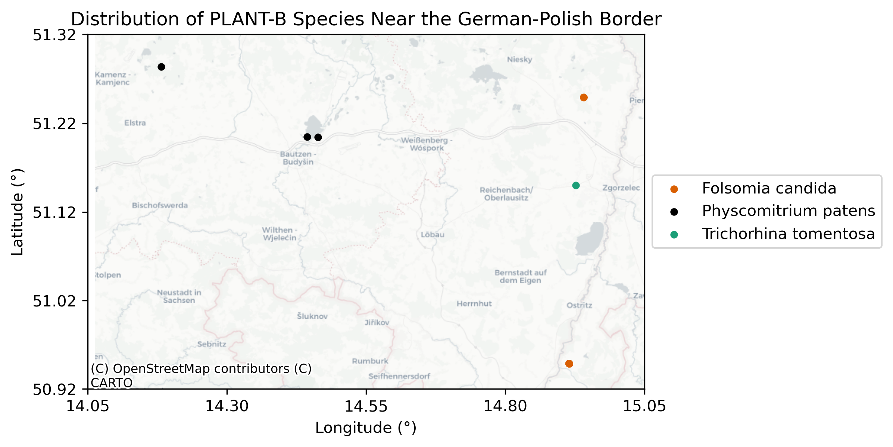
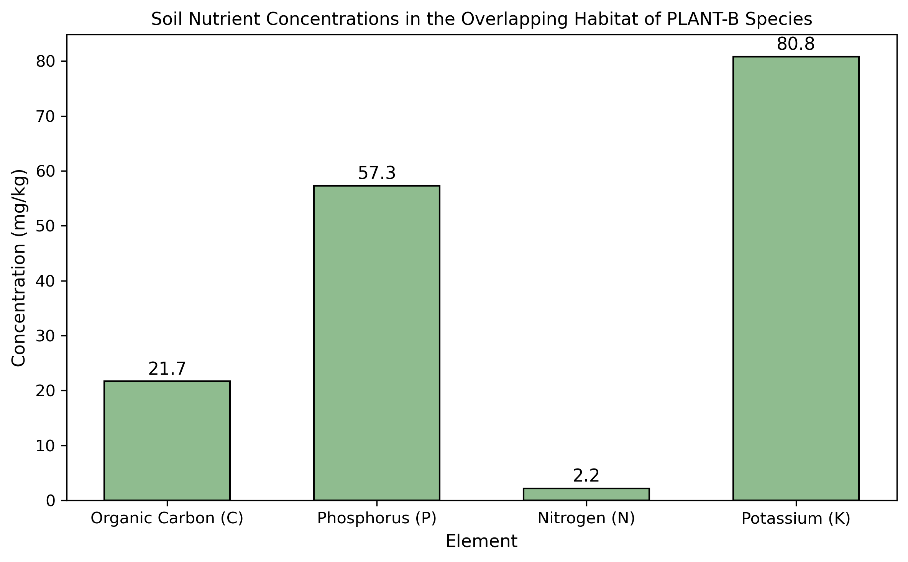

The PLANT-B CubeSat Terrarium Mission is an initiative by The Spring Institute for Forests on the Moon to send a bioactive terrarium into low-Earth orbit for two to five years. Terrarium experiments have been previously been hosted on the International Space Station, but this mission is one of the first attempts to maintain a self-sustaining ecosystem directly in the space environment. A similar initiative by The Spring Institute is Project SCAMPI, though it focuses on aquatic ecosystems instead of terrestrial ecosystems. The significance of these projects is their contribution to scientific understanding of bioregenerative life support systems (BLSS). Instead of using mechanical or physicochemical pathways, BLSS use living organisms to replenish life-sustaining resources for and maintain the habitability of a closed system—most notably, producers like algae are used to replenish oxygen, remove carbon dioxide, and remediate waste. A major obstacle for prospective space settlements will be the need to establish self-sufficiency; as most space settlements will be too far from Earth to depend on resupply fights for resources, BLSS and similar paradigms must be used to as a slow yet efficient regenerative backbone that replaces the infrastructure of traditional Earth societies. Unlike on Earth, ecosystems in closed space habitats will have limited nutrient reserves that must be carefully sustained to avoid ecosystem collapse. By incorporating biotechnologies that enhance their regenerative capabilities, BLSS reduce reliance on external resources and promote self-sustainability, minimizing space waste and impacts to extraterrestrial environments—a feat translatable to conservation and sustainability efforts on Earth.

The current PLANT-B prototype is an unconventional adaptation of bioactive terrariums. The selected invertebrates—the white dwarf isopod (*Trichorhina tomentosa*) and the temperate white springtail (*Folsomia candida*)—are common fixtures in bioactive terrariums, serving as the detritivoric clean up crew that break down waste like feces and mold. These detritivores will play an essential role in removing the leaf litter of the spreading earthmoss (*Physcomitrium patens*), the sole photosynthetic species in the terrarium. Both photosynthesis and decomposition will feed into the terrarium's nutrient cycles, but design choices and the low-Earth space environment may impact this process. Soil will not be used in the final prototype to minimize payload weight; instead, the spreading earthmoss will grow on a substrate called Hygrolon. Soil microbes may be integrated into the terrarium ecosystem to mimic soil dynamics, however. Because of the low-Earth orbit, the organisms will also have to contend with microgravity and rapidly shifting 60-30 minute light dark cycles. This is anticipated to affect the circadian rhythm of all organisms and potentially impact the photosynthetic output of the spreading earthmoss, but it is difficult to preemptively quantify how this may impact the terrarium's nutrient cycles. These nutrient cycle simulations are a small but essential part of PLANT-B, as they will enable contributors to analyze the negative impacts of space on the terrarium ecosystem before launch.

At present, the Global Biodiversity Information Facility (GBIF) is the only database whose data was able to be downloaded through a function; the European Soil Data Centre (ESDAC) and TRY Plant Trait Database required requests to be sent manually. GBIF data was required to find an area of habitat overlap for the three species to parse possible optimal soil nutrient concentrations for species coexistence. ESDAC datasets may also be analyzed to identify relevant soil microbes. Though the chosen species are model organisms for genomics, scientific literature on their role in ecological stoichiometry is almost nonexistent. To overcome this gap, several databases were parsed to find stoichiometric data for closely related species. Close relatives of *P. patens* were determined by looking at a phylogenetic tree produced by Rensing and company. No relevant information on *P. patens* was found in the TRY Plant Trait Database, so information on relevant plant traits like Ellenberg indicator values were requested for closely related species. 156 unique trait entries were returned. Stoichiometric information for the invertebrates was found through the StoichLife database; nitrogen data was found for a close relative of *T. tormentosa*, and nutrient data was found for *Folsomia fimetaria*, a close relative of *F. candida*. Additional literature reviews may be conducted to obtain additional numeric values for the simulation equations.

The appropriate packages were imported, a repository was made on the host computer, and GBIF was logged into through Python. The species info was pulled from GBIF, which enabled the proper search result to be identified; only the dwarf white isopod inquiry had to use the second result, as the first search result had a limited number of observations. To avoid complications associated with requesting multiple species at once, three separate functions were created to download the observation data for each species. All three datasets were combined into a single dataframe, and observations without spatial coordinates were removed. The dataframe was converted to a geodataframe, and an hvPlot was created. The interactive nature of this plot enabled a suitable overlapping area with a low human population to be identified: the German-Polish-Czech border. A bounding box was created to correctly parse all observations in this area. A plot was created to show all species in the overlapping habitat.

A new directory was created to store the soil nutrient concentration and microbe data. ESDAC's LUCAS 2018 TOPSOIL dataset was received after sending in a request, and the zip file was manually moved to and unzipped in the newly created directory. A path was created to "LUCAS-SOIL-2018.csv," and the CSV file was defined as a dataframe. All samples were subsetted to the previous bounding box, which revealed only one sample was taken in the study area. The nutrient concentrations of this soil sample were compared against each other when a bar chart was made.

The most striking feature of this soil sample is its low nitrogen content. Though Ellenberg indicator values suggest close relatives of *P. patens* prefer nitrogen deficient soils, those same values indicate *Physcomitrium* species prefer moderate to high levels of nitrogen in soil. Organic matter composed of organic carbon is also somewhat low, but it is more prevalent than nitrogen by a factor of 10, resulting in a C:N ratio of approximately 9.86:1; this may suggest rapid decomposition and net nitrogen mineralization, but this is difficult to confirm with the low nitrogen levels. Phosphorus and potassium appear elevated compared to typical soil concentrations, which may cause additional stoichiometric imbalances. An environment of rapid decomposition does not seem conducive for a sustainable soil ecosystem, so subsequent analyses in areas of high population are needed to compare nutrient concentration baselines in overlapping habitats.

## Data Sources

González, A. L., Merder, J., Andraczek, K., Brose, U., Filipiak, M., Harpole, W. S., Hillebrand, H., Jackson, M. C., Jochum, M., Leroux, S. J., Nessel, M. P., Onstein, R. E., Paseka, R., Perry, G. L. W., Rugenski, A., Sitters, J., Sperfeld, E., Striebel, M., Zandona, E., Aymes, J.-C., Blanckaert, A., Bluhm, S. L., Doi, H., Eisenhauer, N., Farjalla, V. F., Hood, J., Kratina, P., Labonne, J., Lovelock, C. E., Moody, E. K., Mozsár, A., Nash, L., Pollierer, M. M., Potapov, A., Romero, G. Q., Roussel, J.-M., Scheu, S., Scheunemann, N., Seeber, J., Steinwandter, M., Susanti, W. I., Tiunov, A., & Dézerald, O. (2025). StoichLife: A Global Dataset of Plant and Animal Elemental Content. *Scientific Data*, *12*(1). https://doi.org/10.1038/s41597-025-04852-w

González, A. L., Merder, J., Andraczek, K., Brose, U., Filipiak, M., Harpole, W. S., Hillebrand, H., Jackson, M. C., Jochum, M., Leroux, S. J., Nessel, M. P., Onstein, R. E., Paseka, R., Perry, G. L. W., Rugenski, A., Sitters, J., Sperfeld, E., Striebel, M., Zandona, E., Aymes, J.-C., Blanckaert, A., Bluhm, S. L., Doi, H., Eisenhauer, N., Farjalla, V. F., Hood, J., Kratina, P., Labonne, J., Lovelock, C. E., Moody, E. K., Mozsár, A., Nash, L., Pollierer, M. M., Potapov, A., Romero, G. Q., Roussel, J.-M., Scheu, S., Scheunemann, N., Seeber, J., Steinwandter, M., Susanti, W. I., Tiunov, A., & Dézerald, O. (2025). StoichLife: A global database of plant and animal elemental content [Dataset]. *Dryad*. https://doi.org/10.5061/dryad.3tx95x6r2

Kattge, J., Bönisch, G., Díaz, S., Lavorel, S., Prentice, I. C., Leadley, P., Tautenhahn, S., Werner, G. D. A., Aakala, T., Abedi, M., Acosta, A. T. R., Adamidis, G. C., Adamson, K., Aiba, M., Albert, C. H., Alcántara, J. M., Alcázar C., C., Aleixo, I., Ali, H., Amiaud, B., . . . van der Plas, A. L. D. (2020). TRY plant trait database – enhanced coverage and open access. *Global Change Biology*, *26*(1), 119–188. https://doi.org/10.1111/gcb.14904

Labouyrie, M., Ballabio, C., Romero, F., Panagos, P., Jones, A., Schmid, M. W., Mikryukov, V., Dulya, O., Tedersoo, L., Bahram, M., Lugato, E., van der Heijden, M. G. A., & Orgiazzi, A. (2023). Patterns in soil microbial diversity across Europe. *Nature Communications*, *14*(1), 3311. https://doi.org/10.1038/s41467-023-37937-4

Orgiazzi, A., Ballabio, C., Panagos, P., Jones, A., & Fernández-Ugalde, O. (2017). LUCAS Soil, the largest expandable soil dataset for Europe: a review. *European Journal of Soil Science*, *69*(1), 140–153. https://doi.org/10.1111/ejss.12499

Panagos P., Van Liedekerke M., Jones A., & Montanarella, L. (2012). European Soil Data Centre: Response to European policy support and public data requirements. *Land Use Policy*, *29*(2), 329-338. https://doi.org/10.1016/j.landusepol.2011.07.003

Panagos, P., Van Liedekerke, M., Borrelli, P., Köninger, J., Ballabio, C., Orgiazzi, A., Lugato, E., Liakos, L., Hervas, J., Jones, A., & Montanarella, L. (2022). European Soil Data Centre 2.0: Soil data and knowledge in support of the EU policies. *European Journal of Soil Science*, *73*(6), e13315. https://doi.org/10.1111/ejss.13315

Rensing, S. A., Goffinet, B., Meyberg, R., Wu, S.-Z., & Bezanilla, M. (2020). The Moss *Physcomitrium* (*Physcomitrella*) *patens*: A Model Organism for Non-Seed Plants. *The Plant Cell*, *32*(5), 1361–1376. https://doi.org/10.1105/tpc.19.00828
